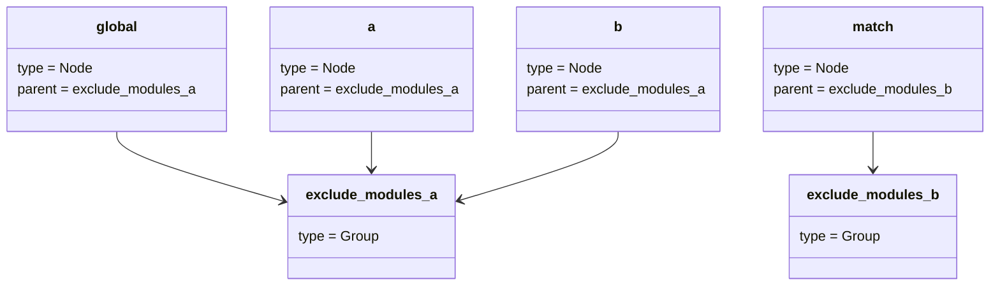

```mermaid
classDiagram
    class global {
        type = Node
        parent = exclude_modules_a
    }

    class a {
        type = Node
        parent = exclude_modules_a
    }

    class b {
        type = Node
        parent = exclude_modules_a
    }

    class match {
        type = Node
        parent = exclude_modules_b
    }

    class exclude_modules_a {
        type = Group
    }

    
    class exclude_modules_b {
        type = Group
    }

    global --> exclude_modules_a
    a --> exclude_modules_a
    b --> exclude_modules_a
    match --> exclude_modules_b
```
````